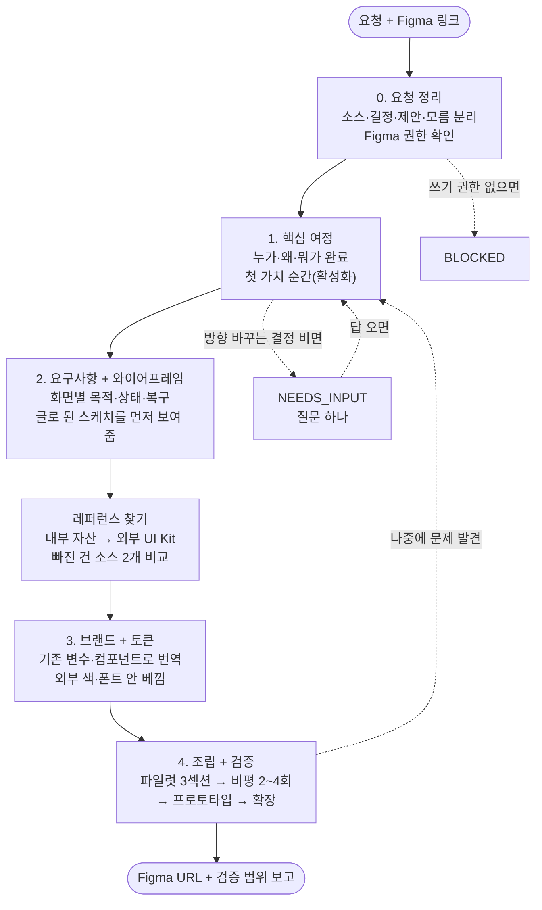
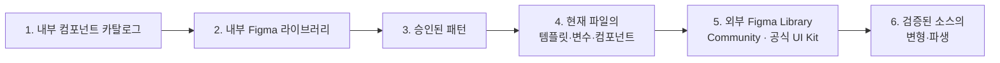
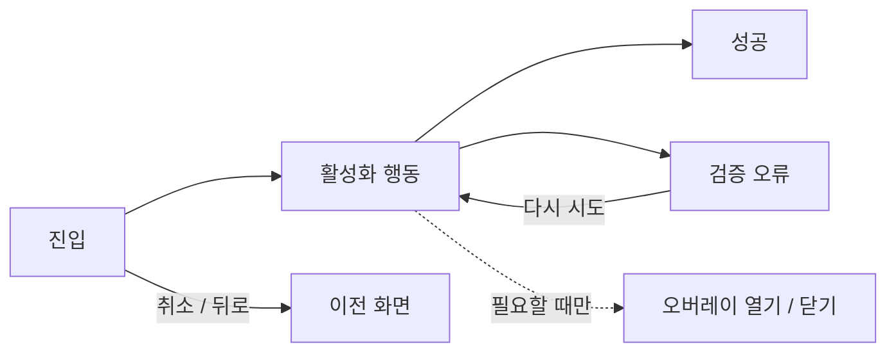
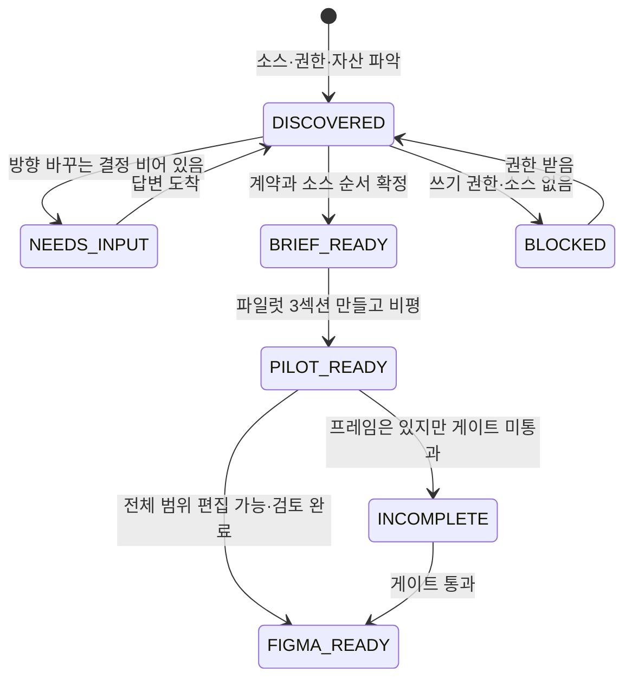
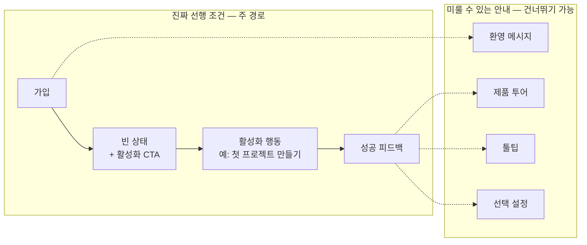

# frontend-interface-design

레퍼런스를 찾고, 와이어프레임으로 먼저 설명하고, 편집 가능한 Figma 디자인을 만들어 주는 스킬이에요.

이 문서는 이 스킬을 처음 써 보는 분을 위해 썼어요. Figma는 써 봤지만 AI 에이전트한테 디자인을 맡겨 본 적은 없는 분이 읽으면 딱 맞아요. 다 읽고 나면 스킬을 설치하고, 첫 요청을 보내고, 에이전트가 단계마다 뭘 하고 뭘 물어보는지 알 수 있어요.

## 이 스킬이 하는 일

- 사용자가 뭘 하려는지(핵심 여정)부터 정리해요.
- 화면을 그리기 전에 글로 된 와이어프레임을 먼저 보여 줘요.
- 팀에 이미 있는 Figma 라이브러리와 검증된 레퍼런스를 찾아서 조립해요.
- 결과물은 언제나 **편집 가능한 Figma**예요. 프레임, 컴포넌트 인스턴스, 변수, 오토 레이아웃이 살아 있는 상태로 넘겨요.
- 만든 뒤에는 스스로 비평하고 고친 다음, 뭘 검증했고 뭘 못 했는지 솔직하게 보고해요.

## 이 스킬이 하지 않는 일

- React, HTML/CSS, Tailwind 같은 코드를 쓰지 않아요. 코드가 필요하면 다른 스킬을 쓰세요.
- 스크린샷을 보고 사각형으로 따라 그리지 않아요. 스크린샷은 비교용 증거로만 써요.
- PNG나 문서를 "Figma 목업"이라고 부르지 않아요.
- Figma에 쓰기 권한이 없으면 대신 다른 걸 만들지 않고 `BLOCKED`라고 말해요.
- 지표, 후기, 로고, 제품 화면을 지어내지 않아요.

## 3분 만에 시작하기

### 1. 설치해요

Claude Code에서 두 줄이면 끝나요.

```text
/plugin marketplace add lodado/shareds
/plugin install frontend-interface-design@my-vibe-coding-helper
```

Codex는 같은 패키지 안의 `.codex-plugin/plugin.json`을 읽어요. 두 에이전트가 같은 `skills/` 폴더를 써요.

### 2. 준비물을 확인해요

| 준비물                | 꼭 필요한가요 | 왜 필요한가요                                       |
| --------------------- | ------------- | --------------------------------------------------- |
| Figma MCP (읽기+쓰기) | 네            | 실제 파일에 프레임을 만들고 결과를 다시 읽어야 해요 |
| 작업해도 되는 페이지  | 네            | 원본을 건드리지 않고 별도 영역에서 작업해요         |
| 내부 Figma 라이브러리 | 있으면 좋아요 | 있으면 외부 검색 없이 내부 자산을 먼저 써요         |
| Refero MCP            | 선택          | 섹션 구성 레퍼런스를 찾을 때 써요                   |

Figma MCP는 제품 이름만 보고 "되겠지" 하지 않고, 도구 설명을 직접 읽어서 읽기·쓰기 가능 여부를 확인해요. 미리보기만 되는 연결이면 만들기 전에 `BLOCKED`로 알려 드려요.

### 3. 첫 요청을 보내요

```text
$reference-driven-figma-design
팀 초대 화면 만들어 줘. 이메일이랑 역할 고르고, 보내기 전에 확인하는 단계 있었으면 해.
Figma 파일은 여기: https://www.figma.com/design/...
```

기존 이름 `$frontend-interface-design`로 불러도 같은 스킬로 이어져요.

## 전체 흐름 한눈에 보기

스킬은 네 단계를 순서대로 밟아요. 앞 단계가 정리돼야 뒤 단계 결과물이 확정돼요. 조사 같은 읽기 전용 작업은 겹쳐서 해도 되지만, Figma에 뭔가 쓰는 건 와이어프레임 설명 뒤에만 해요.



점선은 "되돌아가는 길"이에요. 늦게 문제를 발견하면 전체를 다시 하지 않고, 영향받는 가장 이른 단계만 다시 열어요.

## 단계별로 자세히 보기

### 0. 요청 정리하고 둘러보기

에이전트가 캔버스를 만지기 전에 하는 일이에요.

- 받은 정보를 네 가지로 나눠요. **확인된 소스**(PRD, Figma 파일, 자산), **사용자 결정**(목적, 대상, 방향), **에이전트 제안**(사용자 답변이 아니에요), **모름**(없음과 달라요).
- 기존 파일, 라이브러리, 변수, 컴포넌트, 이미 있는 화면 흐름을 읽어요.
- 편집 모드를 정해요. 섹션마다 하나씩이에요.

| 모드     | 뜻                                    | 예시                    |
| -------- | ------------------------------------- | ----------------------- |
| ASSEMBLE | 기존 프레임을 순서 바꾸고 다시 조합   | 랜딩 섹션 재배치        |
| LOCALIZE | 번역, 폰트, 줄바꿈만                  | 영어 화면을 한국어로    |
| FIDELITY | 지정한 원본을 그대로 재현             | "이 UI Kit 카드 그대로" |
| RESKIN   | 구조는 두고 승인된 비주얼 속성만 변경 | 브랜드 색 교체          |
| REDESIGN | 구성을 새로 설계                      | 새 화면 전부            |

이 단계가 끝나면 상태는 `DISCOVERED`예요.

### 1. 핵심 여정 정하기

"누가, 왜 지금, 뭘 하면 끝나는지"를 한 문장으로 잡아요. 여기서 정한 게 뒤의 모든 화면을 결정해요.

기록하는 것:

- 주 사용자와 상황(숙련도, 기기, 제약)
- 시작 계기(trigger)와 진입점(entry)
- 핵심 과제(사용자 언어로 한 문장)
- 완료 조건
- **첫 가치 순간(활성화)** — 신규 사용자 여정일 때만
- 주 경로, 복구 경로, 정책 경계, 제외 범위

#### 온보딩과 활성화는 달라요

이 스킬은 "온보딩 다 봤다"와 "제품 가치를 처음 느꼈다"를 구분해요.

- **온보딩**은 과정이에요. 가입 폼, 환영 메시지, 제품 둘러보기, 초기 설정, 툴팁이 여기 들어가요.
- **활성화**는 사건이에요. 사용자가 자기 문제를 처음 해결하는 단 하나의 행동이에요. 첫 프로젝트 만들기, 첫 파일 올리기, 첫 메시지 보내기 같은 거예요.

신규 사용자 여정을 설계할 땐 활성화 행동을 먼저 이름 붙이고, 온보딩 단계를 둘로 나눠요.

- **진짜 선행 조건**: 이게 없으면 활성화 행동을 할 수 없어요. 예: 가입.
- **미룰 수 있는 안내**: 없어도 활성화는 돼요. 예: 투어, 툴팁, 프로필 완성. 이런 건 주 경로에서 빼거나 건너뛸 수 있게 해요.

기존 사용자의 일반 작업이면 `activation = completion` 한 줄 적고 넘어가요.

#### 이 단계에서 물어보는 것

방향을 바꾸는 결정이 비어 있을 때만 물어봐요. 한 번에 한 가지씩이에요. 이미 PRD나 기존 화면에 답이 있으면 다시 안 물어봐요.

- 누가 쓰나요? 왜 지금 쓰나요? 뭘 하면 끝난 거예요?
- 신규 사용자라면, 핵심 가치를 처음 전달하는 행동 하나가 뭐예요?
- 인증, 결제, 권한, 프라이버시 정책 중에 경로를 바꾸는 게 있나요?

이 단계가 끝나는 조건: 사용자·목적·완료·정책 결정이 흐름을 안 바꾸고, 활성화 행동이 진입점에서 미룰 수 있는 안내 없이 도달 가능해야 해요.

### 2. 요구사항이랑 와이어프레임

여정을 화면으로 옮겨요. 화면마다 목적, 들어오는 길과 나가는 길, 주 행동과 보조 행동, 꼭 필요한 내용, 다음 상태를 정해요.

상태도 빠짐없이 챙겨요.

- 로딩, 비어 있음, 오류, 권한 없음, 성공
- 뒤로 가기나 취소를 누르면 뭐가 남는지
- 다시 시도하면 어떻게 복구되는지

신규 사용자 여정이면 두 가지를 더 해요.

- 진입점에서 활성화 행동까지 화면 수와 클릭 수를 세서 적어요. 목표치가 아니라 관찰값이에요.
- 비어 있는 상태(empty state)에 활성화 행동 버튼을 넣어요. "데이터가 없어요"만 있으면 안 돼요. 투어를 닫거나 설정을 저장한 건 성공 상태가 아니에요.

#### Figma에 쓰기 전에 이걸 보여 줘요

에이전트는 Figma를 처음 건드리기 전에 다섯 가지를 글로 보여 줘요.

1. 과제와 구조 한 줄
2. 어떤 레퍼런스를 왜 채택하고 왜 버렸는지
3. 번호 붙은 텍스트 와이어프레임 — 실제 제목, 정보, 버튼, 내비게이션이 들어가요
4. 성공 경로, 주요 실패와 복구, 키보드·포커스 순서
5. 왜 이 순서인지, 누르면 뭐가 되는지, Figma의 어떤 자산에 대응하는지

이런 모양이에요.

```text
[1. 초대할 사람 입력]                [2. 보내기 전 확인]
+------------------------+          +------------------------+
| 이메일 [____________]  |   --->   | 받는 사람: <이메일>     |
| 역할   [멤버      v]   |          | 역할: <선택한 역할>     |
| [취소] [검토하기 →]    |          | [뒤로] [초대 보내기]    |
+------------------------+          +------------------------+
                    | 보내는 중 → 성공 또는 오류/다시 시도
```

보여 주는 건 승인을 받으려는 게 아니에요. "진행할까요?"를 반복하지 않고 바로 이어서 해요. 먼저 검토하고 싶으면 "리뷰 기다려 줘"라고 말하면 멈춰요.

작은 수정(버튼 하나 바꾸기 같은)은 기존 설명을 재사용하고, 왜 건너뛰었는지 한 줄만 남겨요.

### 레퍼런스 찾기

와이어프레임에 필요한 자산을 어디서 가져올지 정해요. 순서가 있어요.



내부에 검증된 자산이 있고 비교 요청이 없으면 외부 검색은 건너뛰어요.

빠진 역할이나 상태가 있으면 **컴포넌트 소스 게이트**를 통과해야 해요.

- 서로 다른 외부 소스 **2개 이상**을 같은 내용으로 비교해요.
- 검색 결과 개수, 스크린샷, 한 라이브러리 안의 변형은 비교로 안 쳐요.
- 제목이나 썸네일만 보고 "편집 가능하다"고 판단하지 않아요. 실제 하위 레이어를 열어 봐요. 이미지로 채워진 보드는 자산이 아니에요.
- 증거가 없으면 채택도, 확장도, "다 됐어요"도 없어요. "ㄱㄱ", "빨리", "한방에"는 게이트 면제가 아니에요.

찾은 건 전부 Reference Log에 적어요. 소스, 과제 적합도, 역할(구조·행동·비주얼), 채택 여부, 어디에 썼는지, 검증할 가정까지요.

### 3. 브랜드랑 토큰

레퍼런스에서 가져온 구조를 우리 팀의 비주얼 언어로 번역하는 단계예요.

누가 이기는지 순서가 정해져 있어요. 아래가 위를 덮어쓸 수 없어요.

1. PRD와 제품 요구사항
2. 승인된 브랜드 방향
3. 내부 디자인 자산
4. 선택한 Figma 템플릿
5. 기존 Figma 변수와 컴포넌트
6. 승인된 이전 패턴
7. Refero 레퍼런스
8. 외부 레퍼런스
9. 새로운 디자인 결정

역할도 나뉘어요.

- **비주얼 시스템**(내부 시스템 + 템플릿)이 타이포, 색, 간격, 모서리, 그림자, 버튼, 카드, 폼, 아이콘을 소유해요.
- **구성**(Refero + 외부 예시)은 섹션 구조, 위계, 스크린샷 배치, CTA 위치만 줘요.

그래서 외부 레퍼런스의 색이나 폰트를 구조와 같이 베끼지 않아요. 구조만 가져오고 우리 컴포넌트와 변수로 다시 만들어요.

내부 자산이 충분하면 `internal-default`로 가요. 기존 디자인을 정리하는 리팩터 요청이면 겉모습과 동작을 그대로 지키고, 리디자인하지 않아요.

방향이 안 정해졌으면 대표 섹션 하나에 실제 자산으로 작은 대안 2~3개를 만들어 비교하고, 고른 다음 확장해요. 풀 화면을 먼저 만들지 않아요.

이 단계가 끝나는 조건: 토큰 표가 아니라 실제 Figma 변수, 스타일, 편집 가능한 컴포넌트, 바인딩이 확인돼야 해요.

### 4. 조립하고 검증하기

이제 진짜로 Figma에 만들어요.

**작업 위치**는 기록된 Working Page, 복제한 프레임, Experiment Area 중 하나예요. 원본은 그대로 두고 detach도 안 해요.

**파일럿을 먼저 만들어요.** 전체 페이지를 매핑하되, 캔버스에는 3섹션 정도만 만들어요. 보통 히어로, 가장 강한 제품·증거 섹션, 워크플로 설명 섹션이에요. 부분 수정이면 1~3개예요. 실제 길이의 카피, 실제 스크린샷, 실제 브랜드 자산을 써요. 모바일이 범위에 있으면 같은 파일럿에서 만들어요. 축소가 아니라 순서, 크롭, 그룹, CTA 우선순위를 다시 정해요.

**호출 성공은 증거가 아니에요.** 노드를 만들었다는 응답이 와도 실제로 다시 읽고(read-back) 화면을 열어 봐요.

**비평은 여섯 축으로 해요.**

| 축        | 보는 것                                               |
| --------- | ----------------------------------------------------- |
| 위계      | 크기·위치·대비·간격이 중요도와 맞나                   |
| 구성      | 섹션마다 사용자 질문에 답하나, 레퍼런스 원칙이 살았나 |
| 리듬      | 강조와 쉼이 있나, 밀도가 다 똑같지 않나               |
| 제품 강조 | 실제 스크린샷이 장식으로 쪼그라들지 않았나            |
| 일관성    | 타이포·색·간격·모서리가 한 시스템인가                 |
| 진정성    | 우리 제품 내용인가, 이름만 바꾼 AI SaaS 템플릿인가    |

**AI 느낌 나는 요소를 걸러요.** 근거 없는 카드·알약·그라디언트 남발, 의미 없는 유리 효과, 전부 둥글고 가운데 정렬, 반복되는 벤토 그리드, 가짜 지표와 후기, 섹션마다 똑같은 밀도. PRD나 비주얼 시스템에 근거가 없으면 지워요. 스타일 금지가 아니라 목적 없는 장식을 거르는 거예요.

**고치는 방식**

- 한 라운드에 가장 영향 큰 문제 3개만 고쳐요.
- V1에서 상위 3개, V2에서 나머지 큰 문제, V3에서 마무리, V4는 필요할 때만. 보통 2~4라운드예요.
- 같은 문제가 두 라운드 연속 안 나아지면 소스 선택이나 매핑으로 돌아가요.
- 레퍼런스 구조가 안 맞는다고 반려되면 바로 매핑을 다시 열어요. 폰트 크기나 카드 높이 조정으로 보고하지 않아요.
- 전후 비교는 같은 뷰포트, 같은 상태로 해요. "개선됐어요"는 저장 성공이 아니라 확인된 차이예요.

**검증은 네 가지를 따로 해요.** 소스(어디서 왔나), 충실도(원본과 같나), 콘텐츠(실제 내용인가), 레이아웃(실제 읽기 크기에서 깨지지 않나). 줌아웃한 스크린샷은 증거가 아니에요.

**프로토타입도 연결해요.** 새 흐름이거나 동작이 바뀌는 작업이면 정적 프레임만 넘기지 않아요.



승인된 동작만 연결해요. 버튼이 눌릴 것처럼 생겼다고 아무 데나 연결하지 않아요. 연결한 뒤에는 실제 reaction을 다시 읽어서 어디서 어디로 가는지, 뭘 확인 못 했는지 보고해요. 프로토타입이 된다고 백엔드가 되거나 사용성이 검증된 건 아니에요.

파일럿이 검증되면 나머지 화면, 폭, 상태로 확장하고 다시 검토해요.

### 결과 받기

에이전트가 넘겨주는 순서예요.

1. **실제 Figma URL** — 파일, 페이지, 프레임 ID까지요.
2. **소스 추적** — 조립 단위마다 어디서 왔고, 링크된 인스턴스인지 복사한 프레임인지 로컬 파생인지.
3. **비평 기록** — 라운드마다 뭘 고쳤고, 어떤 뷰포트와 상태를 봤는지.
4. **프로토타입 읽기 결과** — 연결한 hotspot, trigger, 목적지, 확인 못 한 분기.
5. **Reference Log** — 찾아본 레퍼런스와 채택 여부.
6. **검증 못 한 범위** — 숨기지 않아요.

보고는 세 축을 따로 해요.

- `technical`: 읽기·쓰기와 구조 확인이 됐나
- `design-self-review`: ready / incomplete / unreviewed
- `user-acceptance`: accepted / rejected / not-obtained

`FIGMA_READY`는 에이전트의 자체 리뷰예요. 여러분의 승인, 사용성 테스트, 프론트엔드 QA를 대신하지 않아요.

## 상태가 뭘 뜻하나요

에이전트는 지금 어디까지 왔는지 상태로 말해요.



| 상태          | 뜻                                                      | 여러분이 할 일                   |
| ------------- | ------------------------------------------------------- | -------------------------------- |
| `DISCOVERED`  | 뭐가 있고 뭐가 없는지 파악했어요                        | 없음                             |
| `NEEDS_INPUT` | 방향을 바꾸는 결정이 비어 있어요                        | 질문에 답해 주세요               |
| `BRIEF_READY` | 계약이 정리됐어요. 만들기 시작해요                      | 없음                             |
| `PILOT_READY` | 파일럿 3섹션이 됐어요. 전체는 아직이에요                | 파일럿 보고 방향 피드백          |
| `FIGMA_READY` | 합의한 범위 전부 편집 가능하고 검토했어요               | 직접 열어서 승인 여부 결정       |
| `INCOMPLETE`  | 프레임은 있는데 자산·상태·반응형·비평 게이트가 남았어요 | 남은 게이트 확인                 |
| `BLOCKED`     | 쓰기 권한, 소스, 라이선스 승인이 없어요                 | 권한을 주거나 소스를 알려 주세요 |

## 예시: 신규 사용자 온보딩

"신규 사용자 온보딩 디자인해 줘. 가입, 환영 메시지, 제품 투어, 초기 설정, 툴팁 다 넣어 줘."라고 요청하면 이렇게 흘러가요.



1. **0단계**: 기존 파일에 빈 상태 컴포넌트나 체크리스트가 있는지 봐요. 쓰기 권한을 확인해요. 새 화면이라 모드는 REDESIGN이에요.
2. **1단계**: 질문 하나를 해요. "가입 후 사용자가 처음으로 자기 문제를 해결하는 행동이 뭐예요? 첫 프로젝트 만들기? 첫 파일 올리기?" 답이 오면 그게 활성화예요. 가입은 선행 조건, 환영·투어·툴팁은 미룰 수 있는 안내로 분류해요. 초기 설정은 항목마다 나눠요.
3. **2단계**: 진입에서 활성화까지 가장 짧은 경로를 와이어프레임 1~3장으로 그려요. 빈 상태에 활성화 버튼을 넣어요. 투어는 활성화 뒤로 보내거나 건너뛸 수 있게 해요. 화면 수와 클릭 수를 적어요. 다섯 가지 설명을 보여 줘요.
4. **레퍼런스**: 내부에 빈 상태 패턴이 있으면 그걸 써요. 없으면 외부 소스 2개를 비교해요.
5. **3단계**: 기존 변수, 버튼, 폼 컴포넌트로 번역해요.
6. **4단계**: 파일럿은 가입, 빈 상태 + 활성화 CTA, 활성화 성공 화면이에요. 프로토타입은 가입 → 빈 상태 → 활성화 → 성공을 연결해요. 투어 완료를 성공 상태로 만들지 않아요.

## 자주 묻는 질문

**코드로 만들어 달라고 하면요?**
안 만들어요. 이 스킬의 완료는 Figma 핸드오프예요. 구현이 필요하면 다른 스킬로 넘기세요.

**스크린샷 주면 그대로 그려 주나요?**
아니요. 스크린샷은 비교 증거예요. 편집 가능한 원본 프레임이나 컴포넌트를 찾아서 조립해요. 원본을 못 구하면 그 부분은 HOLD하고 알려 드려요.

**"한방에 알아서 해 줘"라고 하면 질문 안 하나요?**
선택·조립·수정·검토를 내부에서 끝내요. 하지만 검증 게이트는 건너뛰지 않아요. 방향을 바꾸는 결정이 비어 있으면 그건 물어봐요.

**질문이 너무 많아요.**
한 번에 하나씩, 방향을 바꾸는 것만 물어봐요. 이미 답이 있는 건 다시 안 물어요. "질문 그만"이라고 하면 미결 사항과 영향을 정리하고 넘어가요. 대신 침묵을 승인으로 치지 않아요.

**색만 바꾸고 싶어요.**
RESKIN 모드로 구조는 그대로 두고 비주얼 속성만 바꿔요. 와이어프레임 설명은 건너뛰고 한 줄만 남겨요.

**기존 디자인 정리(리팩터)도 되나요?**
돼요. 겉모습과 동작을 그대로 지키면서 변수·컴포넌트 구조만 정리해요. 리디자인으로 번지지 않아요.

**흐름도가 필요해요.**
`$ux-flow-diagram`이라고 명시해서 따로 불러야 해요. 이 스킬이 자동으로 실행하지 않아요.

## 막혔을 때

- **`BLOCKED`가 떠요.** Figma MCP가 쓰기까지 되는지, 작업할 페이지가 있는지 확인하세요. 유료 자산이나 라이선스 승인이 필요하면 에이전트가 대신 결제하거나 수락하지 않아요.
- **`NEEDS_INPUT`에서 안 넘어가요.** 질문에 직접 답해 주세요. 에이전트는 자기 제안을 여러분의 답으로 대체하지 않아요.
- **`INCOMPLETE`로 끝났어요.** 보고서의 "검증 못 한 범위"를 보세요. 자산이 없거나, 상태가 빠졌거나, 비평 라운드가 남은 거예요.
- **레퍼런스랑 구조가 달라요.** "레퍼런스 구조를 따르라고 했는데 왜 다르냐"고 말하면 폰트 조정이 아니라 매핑부터 다시 열어요.

## 이 패키지 개발하기

```bash
pnpm --filter @lodado/frontend-interface-design-plugin test
pnpm --filter @lodado/frontend-interface-design-plugin lint
python3 packages/frontend-interface-design/skills/reference-driven-figma-design/evals/check_contract.py
```

- `scripts/*.test.mjs`는 SKILL.md와 references 문구를 정규식으로 고정해요. 문구를 바꾸면 테스트도 같이 바꿔야 해요.
- `evals/behavior-cases.json`은 에이전트가 지켜야 할 행동 케이스예요. 정적 검사만 하고, 실제 모델 행동 평가는 따로예요.

## 파일 구조

```text
packages/frontend-interface-design/
├── skills/
│   ├── frontend-interface-design/SKILL.md       # 호환용 진입점
│   └── reference-driven-figma-design/
│       ├── SKILL.md                              # 본체
│       ├── references/
│       │   ├── request-contract.md               # 요청 정리, 질문 규칙, 상태 전이
│       │   ├── hci-wireframe-workflow.md         # 1·2단계 여정, 와이어프레임, 활성화
│       │   ├── taxonomy-reference-workflow.md    # 사전 항목 → 검색 의도
│       │   ├── research-selection.md             # 검색 순서, 템플릿 선택
│       │   ├── component-source-gate.md          # 소스 2개 비교 게이트
│       │   ├── foundations-brand-workflow.md     # 3단계 브랜드·토큰
│       │   ├── visual-direction.md               # 방향 미정 시 대안 비교
│       │   ├── figma-composition.md              # 캔버스 안전, 파일럿, 확장
│       │   ├── critique-refinement.md            # 6축 비평, AI slop, 반복
│       │   ├── prototype-workflow.md             # 프로토타입 연결과 읽기
│       │   ├── asset-learning.md                 # 검증된 패턴 승격
│       │   ├── edit-contract.md                  # 편집 모드 5종
│       │   └── delivery-contract.md              # 핸드오프 형식
│       ├── evals/                                # 행동 케이스, 정적 검사
│       └── scripts/resolve_dictionary.py
├── scripts/*.test.mjs                            # 문구 고정 테스트
├── .claude-plugin/plugin.json
└── .codex-plugin/plugin.json
```
