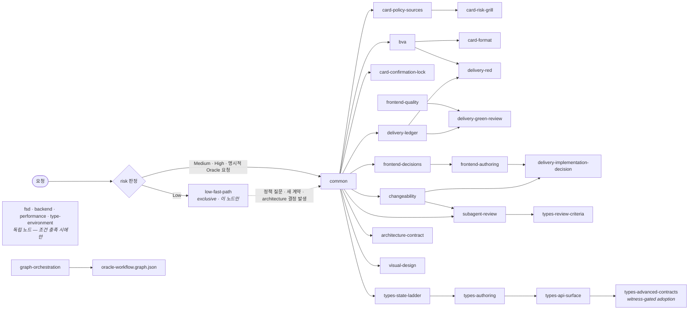

# Frontend Oracle Design

AI가 구현을 시작하기 전에 **무엇이 정답인지 먼저 잠그는** Claude Code / Codex
스킬입니다. 승인된 요구사항을 Oracle Card로 만들고, 테스트·실행 장부·상태 전이·독립
리뷰 같은 결정론적 게이트로 구현을 검증합니다.

## 이런 작업에 적합합니다

- 중복 제출, 비동기 순서, 재시도처럼 경계 동작이 중요한 UI
- 결제, 권한, 파괴적 작업처럼 회귀 비용이 큰 변경
- 현재 코드나 기존 테스트를 제품 정책으로 오인하면 안 되는 작업

단순 문구·토큰·고립된 CSS 수정이나 빠르게 버릴 프로토타입에는 기존 저장소 검증만
사용합니다.

## 동작 방식

1. 사용자 답변과 승인된 명세만 정책 출처로 등록합니다.
2. `Given / When / Then / Never / Source`를 Oracle Card에 기록하고 잠급니다.
3. 명시적으로 Delivery를 요청하면 테스트가 의도한 이유로 실패하는 `VALID_RED`를 먼저
   확인한 뒤 최소 구현으로 통과시킵니다.
4. 실행 결과와 상태 전이를 기계가 기록하고, 정해진 반복 예산 안에서만 수정합니다.
5. 독립 리뷰와 필수 검증을 다시 통과한 `REVIEW_VERIFIED`를 완료로 봅니다.

기본값은 카드 설계에서 멈추는 Design-only입니다. 구현까지 필요하면 Delivery를
명시하세요. 그래프 오케스트레이션도 명시적으로 요청할 때만 로드합니다.

<!-- WORKFLOW_DOCS:START (generated; do not edit) -->

## 워크플로우 그래프

공개 운영자 화면은 전체 제어 그래프를 여섯 단계로 압축합니다. 현재 canonical graph는 노드
19개, 엣지 35개, fallback 5개, terminal 6개입니다.


- 정책 판단이 비면 **policy decision wait**로 나가며, 승인된 정책으로만 DEFINE에 돌아갑니다.
- evidence/harness 문제는 정책·production을 바꾸지 않고 보정한 뒤 BUILD로 돌아갑니다.
- 복구 불가능한 실패는 **failure stop**으로 끝납니다.

이 도식은 operator projection입니다. dispatch, 병렬 high-risk review, join, ledger receipt,
visual-pending resume, 그리고 모든 정확한 전이는
[`oracle-workflow.graph.json`](references/oracle-workflow.graph.json)의 canonical controller
view가 소유합니다.

<!-- WORKFLOW_DOCS:END (generated; do not edit) -->

## Reference 로딩 그래프

계약 문서는 한 번에 다 읽지 않습니다.
[`reference-graph.json`](references/reference-graph.json)이 진입 risk로 lane을 고르고,
`when` 조건이 충족된 노드의 전문과 그 `requires` 엣지만 로드합니다.



화살표는 실행 순서가 아니라 **선행 조건**입니다. `card-format`을 읽으려면 `common`과
`bva`를 이미 읽었어야 한다는 뜻입니다.

`types-advanced-contracts`는
`타입 작업 시 state-ladder와 함께 항상 — 로드는 무조건, 채택은 compiler witness packet gate`
조건으로 로드하고 `types-api-surface`를 선행 조건으로 둡니다. 읽기는 타입 작업마다
무조건이지만, 고급 타입의 **채택**은 문서 안의 선택 gate와 compiler witness packet을
통과할 때만 합니다.

0.24.0에서 추가한 compiler witness, 외부 저장소 provenance, TypeScript와 runtime 검증의
경계는 [`TYPESCRIPT-VERIFICATION.md`](../TYPESCRIPT-VERIFICATION.md)에 정리했습니다.

첫 툴 콜은 lane 진입 노드 **하나**의 Read로 고정되고, 응답은
`risk=<Low|Medium|High> lane=<low-fast-path|oracle> nodes=[실제로 읽은 노드]` 헤더로
시작합니다. 구현 요청이든 설명·플랜 전용 요청이든 동일합니다 — 로딩을 건너뛴 사실이
헤더에 드러나게 만드는 장치입니다.

## 운영 도구

### 현재 상태와 재개

```bash
node skills/scripts/oracle-run.mjs status \
  --dir .ai/oracles/<oracle-id> \
  --json
```

`status`는 lock, worktree/production snapshot, stale run, orphaned `.run-ids`, 남은 budget,
다음 합법 전이를 기존 artifact에서 재계산합니다. resume은 이 출력으로 다음 action을
고르는 절차이며, `run-state.json`이나 `runs.jsonl`을 직접 편집하지 않습니다.

### Black-box eval corpus

`evals/blackbox-corpus.json`은 hosted eval 제품에 의존하지 않는 10개 smoke prompt입니다.
결과 JSON/JSONL을 만든 뒤 grader로 routing, policy invention, false review, tool calls,
tokens, runtime, error count를 확인합니다. 기본 모드는 10개 case를 모두 요구하며, 단일
case 탐색 실행에만 `--allow-partial`을 사용합니다. partial도 빈 결과는 통과하지 않습니다.

```bash
node skills/evals/grade-results.mjs <results.json|results.jsonl>
node skills/evals/grade-results.mjs --allow-partial <results.json|results.jsonl>
```

### Harness garbage collection

새 상태·agent·dependency를 추가하기 전에 stale reference, never-fired sensor, duplicate
guidance, 충돌 규칙을 삭제·통합합니다. High risk에만 `.ai/oracles/**`, lock SHA, run IDs를
CI artifact와 CODEOWNERS/required review로 보호합니다. Low/Medium에는 기본 강제하지
않습니다.

## 설치

Claude Code:

```text
/plugin marketplace add lodado/shareds
/plugin install frontend-oracle-design@my-vibe-coding-helper
```

Codex:

```bash
codex plugin marketplace add lodado/shareds
codex plugin add frontend-oracle-design@my-vibe-coding-helper
```

## 사용 예

```text
이 결제 폼의 중복 제출과 실패 복구를 Oracle Card로 설계해줘.
```

```text
승인한 카드로 테스트를 먼저 작성하고 REVIEW_VERIFIED까지 Delivery해줘.
```

전체 계약과 조건부 reference는 [`SKILL.md`](SKILL.md)를 확인하세요.

## 참고 자료

- [구현보다 정답 기준을 먼저 잠가요 — AI에게 프론트엔드를 맡길 때의 설계](https://bblog-theta.vercel.app/ko/blog/lock-the-oracle-first)
- [비결정론적인 AI 코드, 결정론적인 검문소로 걸러내요 — 워크플로우 단계별 해부](https://bblog-theta.vercel.app/ko/blog/deterministic-gates-for-ai-code)
