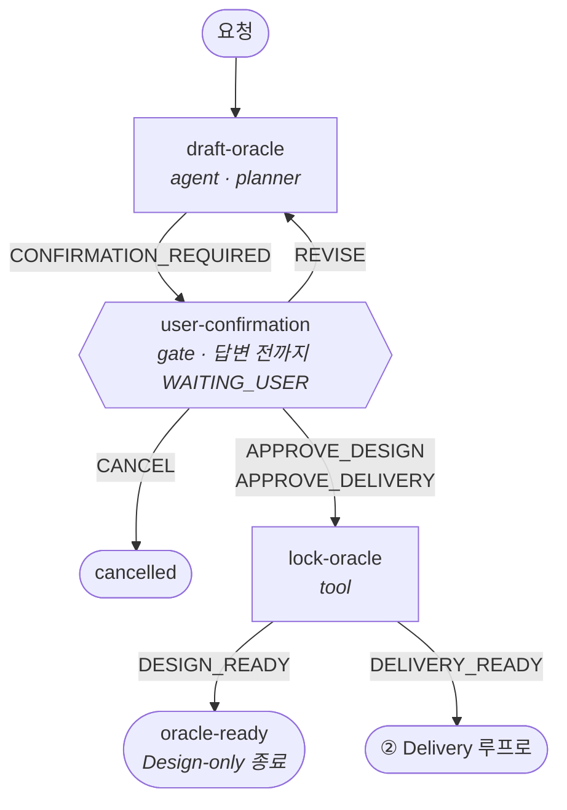
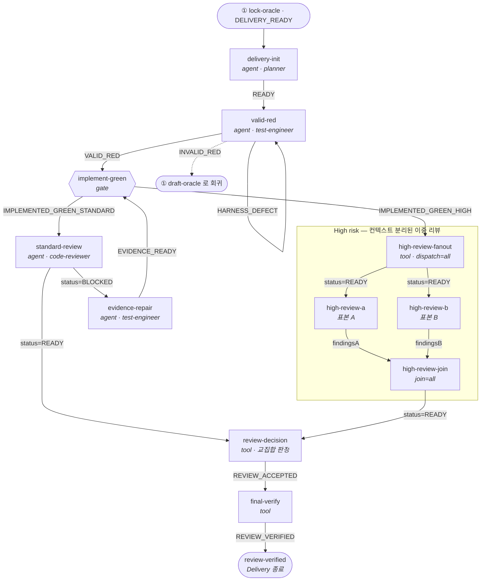

# Frontend Oracle Design

AI가 구현을 시작하기 전에 **무엇이 정답인지 먼저 잠그는** Claude Code / Codex
스킬입니다. 승인된 요구사항을 Oracle Card로 만들고, 테스트·실행 장부·상태 전이·독립
리뷰 같은 결정론적 게이트로 구현을 검증합니다.

## 이런 작업에 적합합니다

- 중복 제출, 비동기 순서, 재시도처럼 경계 동작이 중요한 UI
- 결제, 권한, 파괴적 작업처럼 회귀 비용이 큰 변경
- 현재 코드나 기존 테스트를 제품 정책으로 오인하면 안 되는 작업

단순 문구·토큰·고립된 CSS 수정이나 빠르게 버릴 프로토타입에는 기존 저장소 검증만
사용합니다.

## 동작 방식

1. 사용자 답변과 승인된 명세만 정책 출처로 등록합니다.
2. `Given / When / Then / Never / Source`를 Oracle Card에 기록하고 잠급니다.
3. 명시적으로 Delivery를 요청하면 테스트가 의도한 이유로 실패하는 `VALID_RED`를 먼저
   확인한 뒤 최소 구현으로 통과시킵니다.
4. 실행 결과와 상태 전이를 기계가 기록하고, 정해진 반복 예산 안에서만 수정합니다.
5. 독립 리뷰와 필수 검증을 다시 통과한 `REVIEW_VERIFIED`를 완료로 봅니다.

기본값은 카드 설계에서 멈추는 Design-only입니다. 구현까지 필요하면 Delivery를
명시하세요. 그래프 오케스트레이션도 명시적으로 요청할 때만 로드합니다.

## 워크플로우 그래프

위 5단계를 기계가 검사할 수 있게 옮긴 것이
[`oracle-workflow.graph.json`](references/oracle-workflow.graph.json)입니다. 노드 18개,
엣지 23개, fallback 규칙 5개, terminal 4개. 다음 노드는 Worker가 고르지 않고 컨트롤러가
`graph-verify.mjs next`로 strict-equality 일치한 엣지만 활성화합니다.



Design-only는 여기서 끝납니다. `APPROVE_DELIVERY`로 잠근 카드만 아래 루프에 들어갑니다.



### 반복 실패 경로는 fallback 규칙 5개가 소유

위 도식에 실패 화살표가 거의 없는 이유입니다. 어느 노드에서 나오든 목적지가 같은
분류는 노드마다 엣지를 두지 않고 그래프 최상위 `fallback`이 한 번만 선언합니다.
노드 전용 엣지가 있으면 그쪽이 우선하고(`valid-red`의 `HARNESS_DEFECT` 자기 재시도),
어느 쪽도 일치하지 않으면 여전히 `NO_TRANSITION`으로 멈춥니다.

| 분류             | 뜻                             | 목적지            | 이유                                   |
| ---------------- | ------------------------------ | ----------------- | -------------------------------------- |
| `POLICY_GAP`     | 카드에 없는 정책 판단이 필요함 | `draft-oracle`    | 정책은 카드만 소유 — 구현 중 신설 금지 |
| `FAIL`           | 복구 불가능한 실패·환경 결함   | `failed`          | 마지막 오류와 runId를 ledger에 보존    |
| `PRODUCT_DEFECT` | 제품 코드가 틀림               | `implement-green` | 예산 안에서 구현 재시도                |
| `EVIDENCE_GAP`   | 증거가 주장을 못 받침          | `evidence-repair` | locator·fixture만 보정, 정책 불변      |
| `HARNESS_DEFECT` | 테스트 장치가 고장             | `evidence-repair` | 제품 탓으로 넘기지 않음                |

`ENVIRONMENT_DEFECT`와 `NON_ORACLE_OPINION`은 리뷰 finding 분류로만 남고 graph
label이 아닙니다 — 환경 결함은 사유를 ledger에 남기고 `FAIL`로 보고하며, opinion만
남은 판정은 `review-decision`이 `REVIEW_ACCEPTED`로 정규화합니다.

### 구조에 박아 둔 잠금 장치

- **사용자 확인은 우회 불가** — `user-confirmation`은 gate라 명시적 답변 전까지
  `WAITING_USER`로 멈춥니다. 에이전트가 대신 승인할 수 없습니다.
- **High risk는 표본 2개 교집합** — `high-review-a`/`b`는 서로의 결과를 못 읽고 각각
  `findingsA`/`findingsB`를 냅니다. join이 `input`으로 둘 다 요구하므로 한쪽만 도착한
  판정은 검증기가 거부합니다.
- **정책 변경은 항상 카드로 회귀** — `POLICY_GAP`은 어느 단계에서 나오든 fallback 규칙
  하나를 통해 `draft-oracle` 한 곳으로만 갑니다.

## Reference 로딩 그래프

계약 문서는 한 번에 다 읽지 않습니다.
[`reference-graph.json`](references/reference-graph.json)이 진입 risk로 lane을 고르고,
`when` 조건이 충족된 노드의 전문과 그 `requires` 엣지만 로드합니다.


화살표는 실행 순서가 아니라 **선행 조건**입니다. `card-format`을 읽으려면 `common`과
`bva`를 이미 읽었어야 한다는 뜻입니다.

`types-advanced-contracts`는
`custom exported generic, mapped·conditional·template-literal·recursive type, variance-sensitive callback, deep transform을 설계·변경·리뷰할 때만`
로드하고 `types-api-surface`를 선행 조건으로 둡니다. 단순 Props·feature-local 상태·내장
utility로 끝나는 관계에는 로드하지 않습니다.

첫 툴 콜은 lane 진입 노드 **하나**의 Read로 고정되고, 응답은
`risk=<Low|Medium|High> lane=<low-fast-path|oracle> nodes=[실제로 읽은 노드]` 헤더로
시작합니다. 구현 요청이든 설명·플랜 전용 요청이든 동일합니다 — 로딩을 건너뛴 사실이
헤더에 드러나게 만드는 장치입니다.

## 설치

Claude Code:

```text
/plugin marketplace add lodado/shareds
/plugin install frontend-oracle-design@my-vibe-coding-helper
```

Codex:

```bash
codex plugin marketplace add lodado/shareds
codex plugin add frontend-oracle-design@my-vibe-coding-helper
```

## 사용 예

```text
이 결제 폼의 중복 제출과 실패 복구를 Oracle Card로 설계해줘.
```

```text
승인한 카드로 테스트를 먼저 작성하고 REVIEW_VERIFIED까지 Delivery해줘.
```

전체 계약과 조건부 reference는 [`SKILL.md`](SKILL.md)를 확인하세요.

## 참고 자료

- [구현보다 정답 기준을 먼저 잠가요 — AI에게 프론트엔드를 맡길 때의 설계](https://bblog-theta.vercel.app/ko/blog/lock-the-oracle-first)
- [비결정론적인 AI 코드, 결정론적인 검문소로 걸러내요 — 워크플로우 단계별 해부](https://bblog-theta.vercel.app/ko/blog/deterministic-gates-for-ai-code)
