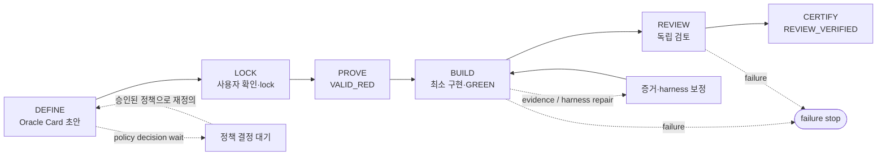
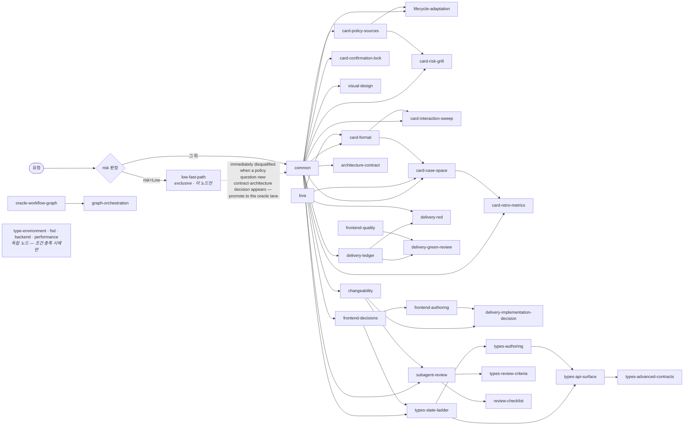

# Frontend Oracle Design

AI가 구현을 시작하기 전에 **무엇이 정답인지 먼저 잠그는** Claude Code / Codex
스킬입니다. 승인된 요구사항을 Oracle Card로 만들고, 테스트·실행 장부·상태 전이·독립
리뷰 같은 결정론적 게이트로 구현을 검증합니다.

## 이런 작업에 적합합니다

- 중복 제출, 비동기 순서, 재시도처럼 경계 동작이 중요한 UI
- 결제, 권한, 파괴적 작업처럼 회귀 비용이 큰 변경
- 현재 코드나 기존 테스트를 제품 정책으로 오인하면 안 되는 작업

단순 문구·토큰·고립된 CSS 수정이나 빠르게 버릴 프로토타입에는 기존 저장소 검증만
사용합니다.

## 동작 방식

1. 사용자 답변과 승인된 명세만 정책 출처로 등록합니다.
2. `Given / When / Then / Never / Source`를 Oracle Card에 기록하고 잠급니다.
3. 명시적으로 Delivery를 요청하면 테스트가 의도한 이유로 실패하는 `VALID_RED`를 먼저
   확인한 뒤 최소 구현으로 통과시킵니다.
4. 실행 결과와 상태 전이를 기계가 기록하고, 정해진 반복 예산 안에서만 수정합니다.
5. 독립 리뷰와 필수 검증을 다시 통과한 `REVIEW_VERIFIED`를 완료로 봅니다.

기본값은 카드 설계에서 멈추는 Design-only입니다. 구현까지 필요하면 Delivery를
명시하세요. 그래프 오케스트레이션도 명시적으로 요청할 때만 로드합니다.

## FSD에서의 도메인 경계 설계

FSD를 이미 사용하거나 도입이 승인된 저장소에서는 폴더 트리보다 먼저 **사용자 기능,
도메인 용어, 불변식과 상태·효과의 소유자**를 정합니다. 공개 API는 다른 도메인이 내부
DTO·store·query key·실행 순서를 알지 않고 사용할 수 있는 계약이어야 합니다.

[FSD 기준](references/fsd.md)은 Matt Pocock의 `domain-modeling`·`codebase-design`에서
용어 구체화, deep module, 변경 국소성, 공개 경계 테스트를 참고했습니다. FSD 공식 규칙과
설계 휴리스틱의 출처를 구분하며, 별도 도메인 문서를 늘리지 않고 기존 아키텍처 문서에
기록합니다. 필드가 같은 독립 도메인의 무조건 통합, 과도한 slice 추출, 도메인 정책의
`shared` 집중을 피하고, 폴더를 옮기지 않는 소유권 변경도 같은 기준으로 검토합니다.

설계 회귀 시나리오는 [`task.md`](../test-fixtures/fsd-domain-design/task.md), 별도 평가 기준은
[`rubric.md`](../test-fixtures/fsd-domain-design/rubric.md)에 있습니다. 문서/그래프 검사는
의미적 설계 품질을 증명하지 않으므로 시나리오 결과는 별도로 평가합니다.

## Contextualized review

The existing independent reviewer can receive selected original callers, consumers, state/error owners,
approved source files and observations through `review-packet --context <manifest.json>`. Their bytes
are pinned alongside the existing card, ledger, diff and review-point criteria. Changing a selected
nonchanged caller also invalidates the review; the same commit is not enough.

For example, a search-hook change is reviewed with its unchanged page consumer, query key/state owner,
error boundary and approved error/empty and response-order rows. The reviewer can distinguish a real
late-response overwrite from protection already provided by the actual query owner. A graph service,
new reviewer team or memoization mandate is not required.

The four perspectives supplement the existing five changeability axes. Medium/High independence,
approval, lock, RED/GREEN and final evidence gates are unchanged. Context-free v2 artifacts retain
legacy behavior; supplied context is validated. Low fast path and Design-only add no mandatory context artifacts or implementation review.
See [the input contract](references/subagent-review.md#contextualized-review--collect-evidence-not-more-agents)
and [paired questions](references/review-checklist.md#contextual-pattern-index).

The [Ericsson paper](https://arxiv.org/abs/2609.15877) supplies design inspiration, not product policy
or performance guarantees. Our packet schema, frontend mapping and regression fixtures are local design
choices. Runtime checks prove structure and input integrity, not model understanding or improved recall.
Live model comparison is **NOT_RUN** without an approved isolated runtime/account/budget; cost, time and
tokens are **unmeasured**. Development fixtures are synthetic, not observed incidents or held-out answers. The runnable O16 corpus is `evals/contextual-review-fixtures.json`; `scripts/contextual-review-evals.test.mjs` materializes each case in a temporary directory, executes its `.mjs` entry, and removes the directory. The existing converter projects original file contents inline in reviewer prompts, with separate expected output/assertions; no external model call is made. Model evaluation is **NOT_RUN (0/12 cases attempted and 0/12 completed)**, with tokens/time/cost **unmeasured**; this is readiness evidence, not a baseline/candidate comparison or quality claim.

## 증거

이 스킬은 "장부에 없는 실행은 증거가 아니다"를 사용자에게 요구합니다. 같은 기준을
스킬 자신에게 적용한 결과입니다.

**Setup.** 번들된 grader에 여섯 가지 결과 아티팩트를 넣고 실제로 돌립니다. 재현
명령은 아래 그대로입니다.

```bash
npm test                                            # 문서 규범과 실제 파일의 결합 검사
node skills/evals/grade-results.mjs <results.json>  # 10-case 코퍼스 전량 채점
```

**Result.** 2026-08-27 로컬 실행.

| 입력                               | authority                   | 판정                           | exit |
| ---------------------------------- | --------------------------- | ------------------------------ | ---- |
| 10개 케이스 전량·기대와 일치       | `AUTHORITATIVE_FULL_CORPUS` | 10/10 pass, routingAccuracy 1  | 0    |
| 1개 케이스만, 플래그 없음          | 동일                        | 나머지 9개 `MISSING_CASE`      | 1    |
| 1개 케이스만, `--allow-partial`    | `NON_AUTHORITATIVE_PARTIAL` | `authoritative: false`         | 1    |
| 빈 배열                            | 동일                        | `EMPTY_RESULTS`                | 1    |
| 빈 파일                            | 없음                        | `BLANK_JSONL`                  | 2    |
| 10개 중 1개가 REVIEW_VERIFIED 자칭 | `AUTHORITATIVE_FULL_CORPUS` | 9/10, `falseReviewVerified: 1` | 1    |

**So.** 부분 실행은 스스로를 authoritative라고 부를 수 없고, 빈 결과는 통과가 아니라
실패이며, 자칭 REVIEW_VERIFIED는 집계에 그대로 드러납니다.

**증명하지 않은 것.** 위 여섯 줄은 grader 게이트를 검증한 것이지 **실제 모델 실행
결과가 아닙니다.** 라이브 10-case 실행 기록은 아직 이 저장소에 없으므로,
routingAccuracy를 스킬의 성능 수치로 인용하지 마세요.

<!-- WORKFLOW_DOCS:START (generated; do not edit) -->

## 워크플로우 그래프

공개 운영자 화면은 전체 제어 그래프를 여섯 단계로 압축합니다. 현재 canonical graph는 노드
20개, 엣지 36개, fallback 5개, terminal 6개입니다.



- 정책 판단이 비면 **policy decision wait**로 나가며, 승인된 정책으로만 DEFINE에 돌아갑니다.
- evidence/harness 문제는 정책·production을 바꾸지 않고 보정한 뒤 BUILD로 돌아갑니다.
- 복구 불가능한 실패는 **failure stop**으로 끝납니다.

이 도식은 operator projection입니다. dispatch, 병렬 high-risk review, join, ledger receipt,
visual-pending resume, 그리고 모든 정확한 전이는
[`oracle-workflow.graph.json`](references/oracle-workflow.graph.json)의 canonical controller
view가 소유합니다.

<!-- WORKFLOW_DOCS:END (generated; do not edit) -->

<!-- REFERENCE_DOCS:START (generated; do not edit) -->

## Reference 로딩 그래프

계약 문서는 한 번에 다 읽지 않습니다.
[`reference-graph.json`](references/reference-graph.json)이 진입 risk로 lane을 고르고,
`when` 조건이 충족된 노드의 전문과 그 `requires` 엣지만 로드합니다. 아래 도식은 그
파일에서 생성되므로 노드나 `requires`가 바뀌면 함께 갱신됩니다.



화살표는 실행 순서가 아니라 **선행 조건**입니다. `card-format`을 읽으려면 `common`과
`bva`를 이미 읽었어야 한다는 뜻입니다.

<!-- REFERENCE_DOCS:END (generated; do not edit) -->

`types-advanced-contracts`는
`always with state-ladder during type work — loading unconditional, adoption via compiler witness packet gate`
조건으로 로드하고 `types-api-surface`를 선행 조건으로 둡니다. 읽기는 타입 작업마다
무조건이지만, 고급 타입의 **채택**은 문서 안의 선택 gate와 compiler witness packet을
통과할 때만 합니다.

0.24.0에서 추가한 compiler witness, 외부 저장소 provenance, TypeScript와 runtime 검증의
경계는 [`TYPESCRIPT-VERIFICATION.md`](../TYPESCRIPT-VERIFICATION.md)에 정리했습니다.

첫 툴 콜은 lane 진입 노드 **하나**의 Read로 고정되고, 응답은
`risk=<Low|Medium|High> lane=<low-fast-path|oracle> nodes=[실제로 읽은 노드]` 헤더로
시작합니다. 구현 요청이든 설명·플랜 전용 요청이든 동일합니다 — 로딩을 건너뛴 사실이
헤더에 드러나게 만드는 장치입니다.

## 운영 도구

### 현재 상태와 재개

```bash
node skills/scripts/oracle-run.mjs status \
  --dir .ai/oracles/<oracle-id> \
  --json
```

`status`는 lock, worktree/production snapshot, stale run, orphaned `.run-ids`, 남은 budget,
다음 합법 전이를 기존 artifact에서 재계산합니다. resume은 이 출력으로 다음 action을
고르는 절차이며, `run-state.json`이나 `runs.jsonl`을 직접 편집하지 않습니다.

### Black-box eval corpus

### Artifact roles and early Delivery checks

Keep the existing artifacts single-purpose: **Card** is the approved contract, **journal** is
non-authoritative investigation and decision rationale, **implementation-decision** records how the
approved contract was implemented, **lock** fixes the revision, and **ledger/evidence** records
execution proof. The source-aware intent audit and Delivery capability discovery only add findings to
these existing artifacts; they do not create a handoff/spec/plan file or a new workflow state.

Capability discovery is Delivery-only and an investigation, not runtime readiness or `VALID_RED`
evidence. It checks actual scripts and reporter configuration rather than rejecting a runner by
package name. Low and Design-only remain on their existing paths.

### Black-box evaluation

`evals/blackbox-corpus.json`은 hosted eval 제품에 의존하지 않는 10개 smoke prompt입니다.
결과 JSON/JSONL을 만든 뒤 grader로 routing, policy invention, false review, tool calls,
tokens, runtime, error count를 확인합니다. 기본 모드는 10개 case를 모두 요구하며, 단일
case 탐색 실행에만 `--allow-partial`을 사용합니다. partial도 빈 결과는 통과하지 않습니다.

```bash
node skills/evals/grade-results.mjs <results.json|results.jsonl>
node skills/evals/grade-results.mjs --allow-partial <results.json|results.jsonl>
```

`evals/run-live.mjs`가 그 결과 artifact를 실제 CLI 실행으로 만듭니다. fixture 통과와 모델 성능을
섞지 않기 위해 권위를 나눕니다 — `loadedNodes`·`toolCalls`·`tokens`·`runtimeMs`는 host transcript에서
기계로 유도하고, routing 판정(`risk`·`lane`·`status`·`labels`·`ceremony`)만 실행이 마지막 ```json
블록으로 자기보고합니다. `loadedNodes`는 read 도구 호출이 오류 없는 tool result로 돌아온 노드만
세고, 경로가 문자열로만 등장한 노드는 `mentionedNodes`에 따로 둡니다. 각 결과의 `attestation`은
필드별로 `observed`·`self-reported`·`unreported`를 기록하며, 자기보고에서 빠진
`policyInvention`·`falseReviewVerified`는 조용한 `false`가 아니라 `FLAG_UNREPORTED:<flag>`오류가
됩니다. 블록이 없으면`NO_MACHINE_REPORT`오류로 실패합니다. sidecar`<out>.meta.json`에 model,
prompt SHA-256, session id, exit code, 원본 자기보고가 남습니다.

`--replicates <k>`는 같은 fixture를 k번 독립 실행해 `replicateId`(r1..rk)를 붙입니다. `--variant
<name>`은 A/B 팔(예: baseline·compressed)을 표시합니다. grader의 채점 단위는 `(caseId, variant)`이며
팔끼리는 절대 합산하지 않습니다(`metrics.variants`). 한 팔 안에서 replicate를 각각 채점해 모두
통과해야 통과(pass^k, `metrics.passAllK`)로 보고, 하나라도 통과한 비율은 `metrics.passAtK`로 따로
냅니다. 서로 다른 k는 `metrics.replicateCounts`로 드러나고, replicateId 없이 반복된 case는 여전히
`DUPLICATE_CASE`입니다. 같은 `--repo` 작업 폴더를 반복 사용하므로 실행 간 오염 격리는 호출자
책임입니다.

For non-sensitive fixtures only, `--transcript-dir <dir>` retains raw host stdout/stderr in a fresh
run directory and links the files from `<out>.meta.json`. Capture is opt-in; it does not promote
self-reported ceremony or routing to observed evidence. Review these records and pre/post file
inventories manually to assess source-review input isolation or failure before Draft/lock/init.
Missing records mean unverified, not PASS. The separate `adversarial-corpus.json` contains manual
source-intent diagnostics, not additional authoritative black-box grades.

For A/B comparisons, pin each skill revision and use a pristine fixture workspace and independent
host session for every case/replicate. Verify the actual loaded skill paths; repeating `--repo`
does not isolate filesystem changes. Static fixture tests do not establish model quality gains.

```bash
node skills/evals/run-live.mjs --host claude --out results.jsonl --repo <대상 레포>
node skills/evals/run-live.mjs --host claude --out results-k3.jsonl --repo <대상 레포> --replicates 3
node skills/evals/run-live.mjs --host codex --out held-out.jsonl --corpus held-out.json
```

held-out은 grader가 점수 매기지 않습니다. `escapes[].assertion`을 Draft와 대조해 판정하며, corpus
기대값을 고치는 사람이 홀드아웃 정답을 만질 수 없도록 분리된 채로 둡니다.

### 기계 유도 — 코드와 형제 카드에서 빈칸을 만든다

카드 안의 열거(스윕·deviation·frame)는 카드 바이트에서 기계가 만든다. 0.41.0부터 그 원칙이 카드 밖으로
넓어진다 — 판정은 여전히 사람과 LLM의 disposition이고, 기계는 빈칸의 범위만 넓힌다.

- `scripts/oracle-dimensions.mjs --path <file>...` — 고정 패턴 표로 코드에서 Case space 차원 후보
  (`code(path#L)` 인용 포함)와 side-effect 인벤토리를 뽑는다. 카드에 자동 기입하지 않는다.
- `scripts/oracle-verify.mjs card --repo-policies` — 같은 레포의 잠긴 형제 카드 중 surface 토큰을
  공유하는 정책을 스윕 counterpart 후보(`P3 × <oracle-id>.P7`)로 낸다. 정보이지 게이트가 아니다.
- `scripts/oracle-verify.mjs scan --side-effects --oracle <card> --path <changed files>` — diff의
  알려진 side-effect 토큰마다 카드의 어떤 행이 그 범주를 소유하는지 대조한다. 미소유는
  `SIDE_EFFECT_UNOWNED`, 면제는 `oracle:side-effect <row|reason>` 주석.
- `scripts/oracle-run.mjs status --dir <dir> --changed-files` — init 기준선 이후 바뀐 경로만 한 줄씩.
  레포의 related-tests 명령에 그대로 넘겨 필수 라벨 `impact`를 만든다.
- `scripts/oracle-verify.mjs card --ir` — 카드 바이트에서 파생한 Judgment Space IR(JSON) 덤프.
  `impossible`은 witness가 필수이고(`code()`·`constraint()`는 실재 검사), `needs-evidence`는 조회처가
  필수다. 역-2-sample 리뷰와 지표 집계가 이 IR을 읽는다.
- `scripts/oracle-verify.mjs review --blind-map <file>` — evidence.json을 보지 않은 리뷰어의 테스트→행
  매핑과 대조한다. 불일치는 `EVIDENCE_MAPPING_DISPUTED`.
- `hooks/hooks.json` — Claude Code PreToolUse hook. 플러그인 루트의 이 파일을 Claude Code가 자동으로
  읽으므로 `plugin.json`에 등록하지 않는다. `ORACLE_READY`에서 production 쓰기, `VALID_RED` 이후
  **기존** 테스트에 약화 토큰 추가를 쓰기 전에 거절한다(스냅샷에 없는 새 테스트 파일은 순서 게이트가
  본다). 판정 불가는 허용(fail-open)이고 사후 게이트가 계속 권위다. Codex·jcode에는 hook이 없다.
- `evals/to-skill-creator-evals.mjs` — 블랙박스 코퍼스와 `evals/held-out.json`을 skill-creator
  `evals/evals.json`으로 투영한다. `--check`가 드리프트를 잡는다. held-out은 저자가 아니라 다른 레포에서
  실제로 새어나간 결함이 정답을 준 케이스다(r11b: StrictMode 타이머·리마운트 scrollTo·ResizeObserver
  초기 측정·필터 전환 중 Suspense 폴백). "나아졌나"는 이 케이스의 버전 간 A/B로만 답한다.

### 조건부 실행 가드레일 — 기존 계약의 작은 보강

조사 기준은 HEAD `8f988fe851d1131a9763983609cdf9ced56c5f4a`입니다. 기존 조건부 graph,
escape 회고, 승인/lock, ledger, 쓰기 hook을 재구현하지 않습니다.

| 이미 있는 기능                  | 실제 부족한 부분                         | 재사용할 위치                                        | 최소 변경안                         |
| ------------------------------- | ---------------------------------------- | ---------------------------------------------------- | ----------------------------------- |
| `when`/`requires`와 생성 bundle | 실패 대응 시점과 규칙의 연결             | 기존 graph 소유 노드                                 | 적용 시점 투영; 새 노드/라우터 없음 |
| escape 회고와 feedback routing  | 실행 실패와 잘못된 행동의 구별·후보 검토 | `card/retro-metrics.md`, journal/ledger/diff/finding | 선택적 후보화; escape 스키마 불변   |
| lock·RED/GREEN·review·hook      | 금지와 정상 예외의 대응 검증             | confirmation-lock, Delivery 노드                     | 기존 계약 seed와 prevent/allow 쌍   |
| Low carve-out                   | 과잉 중단을 막는 명시적 회귀 사례        | Low 단일 노드                                        | 기존 세 조건만 적용, 새 산출물 없음 |

**논문에서 가져온 아이디어.** [AgentGuard: Learning Execution Guardrails from Anomalous
Coding-Agent Trajectories](https://arxiv.org/abs/2609.16287) (v1)의 Evidence Extraction / Rule
Induction / Rule Organization: 관찰 가능한 context·action·outcome·support·stage에서 후보를
만들고, `When`·`DoNot`·`Unless`·`Instead`·`ApplyAt`으로 표현하며, 병합 시 정상 예외를
보존하고 필요한 작업 시점에만 읽습니다. 논문도 지침 로딩을 권한 변경이나 도구 가로채기로
보지 않으며, 과잉 거절과 정상 작업 손실을 별도 문제로 다룹니다.

**저장소에 맞춘 설계.** 여섯 개의 `origin: existing-contract`, `status: proposed` seed는
`evals/boundary-cases.json`의 검사 전용 메타데이터에 두고 기존 reference 소유 노드를 연결합니다.
런타임 문서에서 seed JSON을 읽지 않습니다. 실제 사고에서 도출한
규칙이라고 주장하지 않습니다. 원본 실행 증거는 기존 산출물을 인용하고, 후보 검토는
`card/retro-metrics.md` 한 곳이 소유합니다. 관찰 → 직접 증거/기존 원인 분류 → 후보 →
중복·충돌·예외와 prevent/allow 검토 → 기존 저장소 검토·승인 → 후속 실행의 해당 graph
노드에서 조건부 적용 → **기존 Oracle 판정**입니다. 현재 문제의 feedback routing은 후보
검토를 기다리지 않습니다. 후보가 proposed여도 기존 계약은 이미 유효합니다. 저장소의 스킬
변경 승인은 개별 Card 확인, revision lock, 유효 RED, `$test` 판정 또는 독립 리뷰를 대신하지
않습니다. Low/Design-only의 범위, 예외 경로, 예산, CLI와 과거 산출물은 그대로입니다.

**검증 구분.**

- **A — 구조:** `scripts/execution-guardrails.test.mjs`는 필드·참조·소유 노드·prevent/allow
  연결을 검사합니다. 기존 graph/skill-contract/bundle 및 eval projection 검사도 유지합니다.
  `evals/boundary-cases.json`의 `fod-sem-guard-*` 12개는 `synthetic-fixture`인 수동 의미 검토
  사례입니다. 기대 출력과 문자열 검사는 실제 모델 행동의 증거가 아닙니다.
- **B — 결정론적 동작:** 이번 변경은 helper/router/hook/runner를 수정하지 않습니다. 기존
  lock·run·verify·hook 테스트가 실제 거절/허용·상태·부작용을 계속 검증합니다. A의 성공을
  새로운 런타임 차단 기능으로 해석하지 않습니다.
- **C — 에이전트 행동:** 승인된 격리 환경에서는 기존 `evals/run-live.mjs`에
  `--corpus boundary-cases.json --case fod-sem-guard-<rule-id>-<prevent|allow>`와
  `--variant baseline|candidate`, `--transcript-dir <dir>`를 사용합니다. semantic 사례는
  blackbox grader의 자동 점수가 아니라 실제 trajectory/diff와 `assertions`의 수동 검토
  대상입니다. 정답 fixture를 실행 에이전트에게 읽히지 않습니다. 각 case/replicate에 초기화된
  작업 공간·독립 세션과 고정 skill revision/실제 로딩 경로를 사용하고, 같은 작업·모델·환경·
  도구 권한·예산으로 비교합니다. 현재 runner가 이 격리나 예산을 대신 보장하지 않습니다.

행동 비교에서는 비정상 행동, 정상 작업 완료, 불필요한 거절, 필수 증거 없는 완료를 **함께**
확인합니다. 각 조건의 planned/attempted/completed 표본 수와 분모, NOT_RUN, host 실행 실패를
따로 공개하고, 누락/실패를 정상 실행으로 세지 않습니다. 비용·시간·토큰은 실제 측정한 것만
기록하며 나머지는 `unmeasured`입니다. 구조/fixture 테스트를 행동 성능으로 환산하거나,
논문의 성능 수치가 이 스킬에서 재현됐다고 주장하거나, 지표로 기존 gate를 완화하지 않습니다.
held-out 정답은 규칙 구성/수정에 사용하지 않습니다.

이번 업데이트의 C 평가는 **NOT_RUN**: CLI 실행 파일은 확인했지만 계정 사용·격리된 fixture
작업 공간·모델/도구 권한/예산이 고정된 승인된 live 평가 환경은 확보하지 않았습니다.
계획은 조건당 12개 합성 사례 × 1회, baseline/candidate 각각 attempted=0, completed=0,
NOT_RUN=12, host 실행 실패=0/0 attempted(시도 없음; 실패율 아님)입니다. 행동 지표는 분모가
없어 산출하지 않았고, 비용·시간·토큰은 `unmeasured`입니다. 새로운 실제 사고·성공 기록이나
개선 성과는 만들지 않았습니다. 실행환경을 갖춘 뒤의 실제 A/B 평가는 남아 있습니다.

### Hook이 사전 차단하는 것과 게이트만 보는 것

hook은 가속기이고 `oracle-run.mjs transition`이 최종 권위입니다. 아래 표의 "게이트"는 쓰기가 이미
일어난 뒤 `status --changed-files`와 transition 검증이 잡는다는 뜻입니다.

| 경로                                      | Claude Code      | Codex·jcode | 판정                                            |
| ----------------------------------------- | ---------------- | ----------- | ----------------------------------------------- |
| `Write`·`Edit`·`MultiEdit`·`NotebookEdit` | hook이 사전 거절 | 게이트      | `PRODUCTION_TOUCHED_BEFORE_RED`·`TEST_WEAKENED` |
| Bash `rm`·`mv`·`sed -i`·heredoc 쓰기      | 게이트           | 게이트      | hook은 도구 이름과 경로로만 보므로 판정 불가    |
| MCP·에디터 확장 쓰기                      | 게이트           | 게이트      | 같은 이유                                       |
| `.ai/oracles/**` 자체                     | 통과             | 통과        | 오라클 아티팩트는 production이 아님             |

판정 불가는 fail-open이지만 조용히 사라지지 않습니다. hook은 stderr에 한 줄 JSON을 남깁니다 —
`{"oracleGuard":"unjudged","reason":"STATE_UNPARSEABLE"|"SCAN_ROOT_MISSING"|"PAYLOAD_UNREADABLE",...}`.
stdout과 종료 코드는 그대로이므로 쓰기는 계속 진행되고, 흔적만 남습니다.

### Harness garbage collection

새 상태·agent·dependency를 추가하기 전에 stale reference, never-fired sensor, duplicate
guidance, 충돌 규칙을 삭제·통합합니다. High risk에만 `.ai/oracles/**`, lock SHA, run IDs를
CI artifact와 CODEOWNERS/required review로 보호합니다. Low/Medium에는 기본 강제하지
않습니다.

## 이웃 스킬과의 결합

Oracle은 테스트·스크린샷·구현 옵션을 직접 소유하지 않고 이웃 스킬에 위임합니다. 위임
강도는 셋으로 나뉘며 **의도적으로 다릅니다** — 아래 표가 그 지도입니다. 한쪽을 고치면
반대쪽도 함께 확인하세요.

| 이웃 스킬                  | 결합 강도              | 규칙                                                                           |
| -------------------------- | ---------------------- | ------------------------------------------------------------------------------ |
| `$test`                    | hard — 없으면 `FAIL`   | 테스트 파일 작성 직전 이름으로 호출. 호출 불가면 Oracle이 판정을 포기합니다.   |
| `$frontend-visual-qa`      | explicit-only          | 사용자가 명시 요청할 때만. Oracle은 별도 브라우저 완료 상태를 만들지 않습니다. |
| `$agent-graph-engineering` | explicit-only          | 그래프 오케스트레이션을 명시 요청할 때만 로드합니다.                           |
| `$frontend-system-design`  | graceful — 없으면 진행 | 설치되어 있으면 reference만 읽고, intake와 통제는 Oracle이 유지합니다.         |

`$test`만 hard인 이유는 테스트 판정 소유권이 의도된 신뢰 경계이기 때문입니다. Oracle이
자기 테스트를 스스로 쓰고 스스로 통과 판정하면 증거가 순환합니다.

`references/bva.md`는 `packages/test`와 **바이트 단위로 동일한 사본**입니다. 두 스킬이
같은 경계값 축을 쓰지 않으면 계약과 테스트가 조용히 갈라지므로 사본을 없애지 말고
동기화 상태로 두며, `skill-contract.test.mjs`가 동일성을 검사합니다.

## 설치

Claude Code:

```text
/plugin marketplace add lodado/shareds
/plugin install frontend-oracle-design@my-vibe-coding-helper
```

Codex:

```bash
codex plugin marketplace add lodado/shareds
codex plugin add frontend-oracle-design@my-vibe-coding-helper
```

## 사용 예

```text
이 결제 폼의 중복 제출과 실패 복구를 Oracle Card로 설계해줘.
```

```text
승인한 카드로 테스트를 먼저 작성하고 REVIEW_VERIFIED까지 Delivery해줘.
```

전체 계약과 조건부 reference는 [`SKILL.md`](SKILL.md)를 확인하세요.

## 참고 자료

- [구현보다 정답 기준을 먼저 잠가요 — AI에게 프론트엔드를 맡길 때의 설계](https://bblog-theta.vercel.app/ko/blog/lock-the-oracle-first)
- [비결정론적인 AI 코드, 결정론적인 검문소로 걸러내요 — 워크플로우 단계별 해부](https://bblog-theta.vercel.app/ko/blog/deterministic-gates-for-ai-code)
