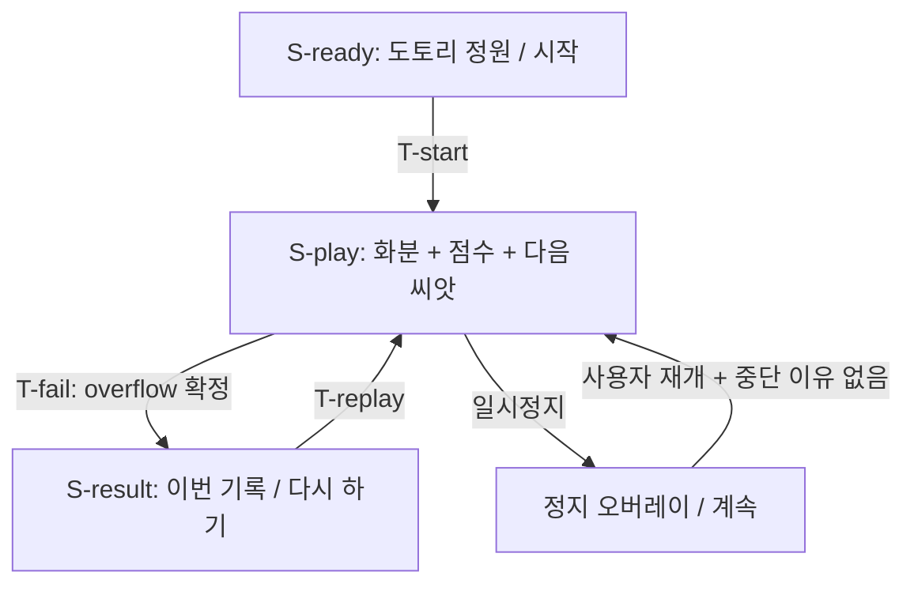
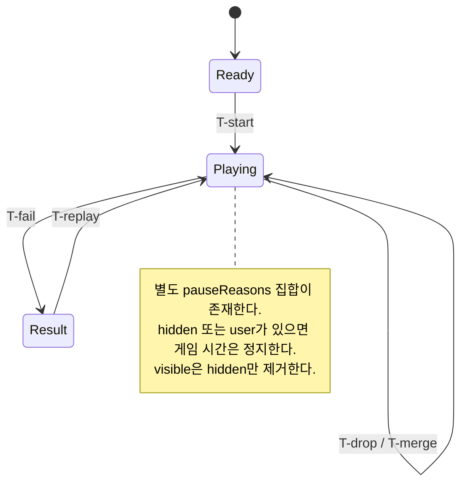

# 플레이 플로우 — 제안

## 첫 플레이

추가 계정·투어 없음. 로딩 완료 → 시작 → 드래그 미리보기/놓기 → 실제 합체. 첫 meaningful action 전 별도 설정 화면을 요구하지 않는다. 처음 몇 초에는 플레이 영역 옆에 ‘옮기고, 손을 떼면 떨어져요’를 표시하며 직접 입력 후 사라진다. 무음으로도 시작할 수 있다. 타이밍은 목표가 아니라 실험에서 측정할 항목이다.

J-play: 준비 화면에서 시작하고 배치·결과를 배운다. J-replay: 실패 이유를 보고 다시 한다.





위 다이어그램은 제안이며 Figma나 실행 코드에서 추출한 자료가 아니다.

## [1] S-ready

```text
┌──────────────────────────┐
│        도토리 정원        │
│   작은 씨앗을 큰 꽃으로   │
│                          │
│     [화분 컨셉 영역]      │
│                          │
│          [시작]          │
│       소리: 끔 / 켬      │
└──────────────────────────┘
```

A-start → T-start. 로딩 중 시작은 비활성이고 진행/실패 안내를 제공한다. 실패 시 로딩 재시도, 게임 시작 사건은 한 번만 발생한다. 컨셉 영역은 최종 에셋이 아니다.

## [2] S-play

```text
┌──────────────────────────┐
│ 점수 12   다음: 씨앗  [Ⅱ] │
│ ─── 넘치면 끝나요 ────── │
│          · preview       │
│                          │
│         플레이 필드      │
│    ○ ○   ◉   ◎           │
│                          │
│  옮기고 손을 떼면 떨어져요│
└──────────────────────────┘
```

12점은 예시 콘텐츠다. A-drop → T-drop. preview는 손가락보다 위쪽에 표시해 낙하 위치를 읽게 한다. 포인터 이동과 투하 허용 타이밍은 별개다. 정지 버튼은 플레이 영역에 입력을 통과시키지 않는다.

위험선은 색뿐 아니라 선/아이콘/문구로도 알려준다. danger grace가 끝난 실제 객체가 넘칠 때만 경고 상태로 바꾼다. 화면이 짧으면 도움말을 줄이되 화분 판정 비율을 왜곡하지 않는다.

## [3] S-result — 같은 필드 위 오버레이

```text
┌──────────────────────────┐
│     [정지된 마지막 판]   │
│    ┌────────────────┐    │
│    │ 화분이 가득 찼어요│  │
│    │ 이번 기록 12점   │   │
│    │   [다시 하기]    │   │
│    │   [처음으로]     │   │
│    └────────────────┘    │
└──────────────────────────┘
```

A-replay → T-replay. 결과 오버레이는 필드 입력을 막고 메뉴 포커스를 유지한다. 점수를 읽을 최소 기회는 제공하지만 정해진 긴 애니메이션이 재시작을 막지 않는다. 처음으로는 새 판을 만들지 않고 준비 화면으로 간다. 브라우저 뒤로가기는 사이트 이탈 경계를 별도로 안내하며 브라우저 이력을 함부로 가두지 않는다.

## 취소·복구

hidden은 pauseReasons에 hidden을 추가하고 진행 중 gesture를 취소한다. visible은 hidden만 제거하며 사용자가 정지한 상태는 유지한다. 중첩 이유가 모두 해소되기 전 simulation은 재개되지 않는다. 광고는 범위 밖이다.

화면 회전/resize는 입력 좌표 매핑을 새로 계산하고 활성 gesture를 취소한다. 새로고침은 진행 중 판을 복원하지 않는 MVP 정책을 명시한다. 로컬 최고점 저장 실패는 현재 플레이를 막지 않고 ‘기록을 저장하지 못했어요’를 표시한다. 손상된 저장 데이터는 최고점 0의 복구 제안과 함께 격리한다.

DOM 메뉴의 키보드/포커스 경로는 별도 검사한다. Canvas 게임 전체가 접근 가능하다고 선언하지 않는다. 이를 위한 대체 조작/설명 요구는 플레이테스트 전 검토 과제다.
